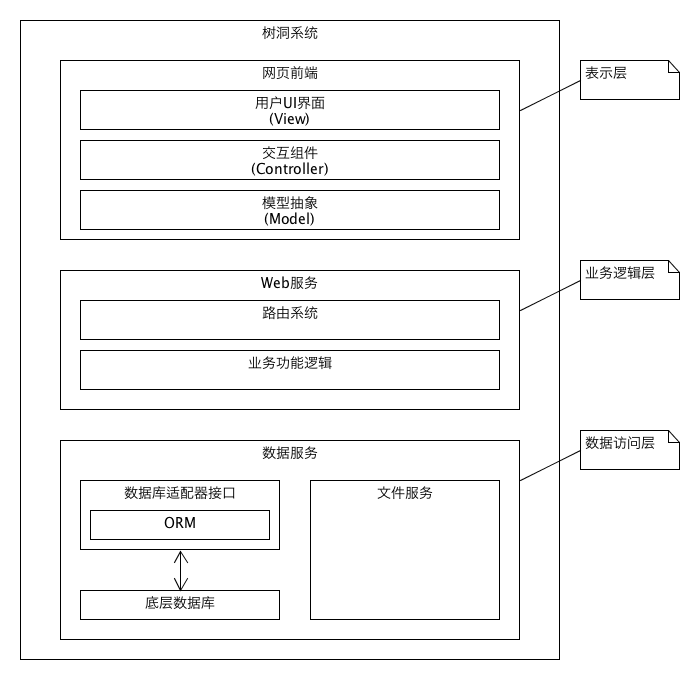

# 系统分析与设计第十三周作业

## 问答题

### 1. 描述软件架构和框架之间的区别和联系

软件架构指的是一个软件系统的高层抽象结构，包含各个不同功能的软件组件以及它们之间的关系。

而框架则是可选的软件应用实现以及部署的一种方式，软件框架可能提供开发过程中需要的各种开发工具、库以及可以被其它部件调用的接口。

所以软件架构和框架之间的区别在于前者是只是提供系统之间的逻辑结构，而不涉及实现。而框架是实现软件系统中某个或某些部分选择的方法。

两者的实现软件架构在一定程度上可以影响对实现方式——也就是实现过程中框架的选择，需要选择合适的框架来实现功能。而如果程序员的技术栈相对较浅，则可能优先选用程序员熟练掌握的框架或者流行的框架进行开发，这时软件架构就需要适应框架来进行调整。两者在软件开发的过程中是紧密联系的。

### 2. 以你的项目为案例：

#### 1) 绘制三层架构模型图，细致到分区

#### 2) 结合你程序的结构，从程序员角度说明三层架构给开发者带来的便利

三层架构的优点在于明确分割了软件各组成部分的职责，使得程序员可以以一个较低的思维成本就能给出一个可以接受的软件架构。

同时三层架构明确了各个程序员的分工，例如客户端程序员只需要考虑界面的展示，集中精力在处理合理且用户友好的UI界面上，而不需要过多考虑具体业务处理的逻辑。而在业务逻辑层，程序员集中精力处理系统中功能的处理流程以及高层次逻辑，以及整个系统的程序抽象，而不用过多在乎底层细节或者其它展示细节。而数据库程序员只需要和数据库的底层调优，包括根据业务需求的不同进行数据库系统的选型以及表的结构设计，向上提供程序员友好的接口即可。

因此三层架构给开发者提供了一个较为清晰地逻辑上的分工，使得各部分开发者可以各司其职，在管理和测试上也有很大的便利。

### 3. 研究Vue与Flux状态管理的异同

我对前端框架了解甚少。以下答案分别参考了：[vuex.vuejs.org](https://vuex.vuejs.org/)以及[flux-concept](https://github.com/facebook/flux/tree/master/examples/flux-concepts)

在状态管理上，vuex和flux都试图解决传统mvc状态管理上的缺陷，也就是当view和model之间的对应关系不明确，或者产生多多对应的时候，编程复杂性以及代码的管理难度急剧提升的问题。

因此两者都抽象出了`action`，来用作当`view`发生改变时应当传递给`model`的部分，而对`model`采用一种集中管理的方式，通过“某种方式”将`action`分发给`model`来产生对应的行为。而`model`的变化再重新用某种方式反馈给`view`，以此触发一个事件循环。

而vuex和flux选择不同的在于`action`产生的后续行为。在`flux`中，`action`被传递给`dispatcher`，`dispatcher`触发所有`store`中对应`action`的程序逻辑，因此程序逻辑被实现在不同的`store`中。而在vuex中，action触发的是不同的`mutation`，`mutation`后续更新`state`，也就是说把`store`拆分为了程序逻辑和数据两个部分，对框架进行进一步的解耦。

由于不了解前端框架以及没有相关开发经验，对于这产生的更深远影响就不进行分析了，只简单陈述一下表面现象。