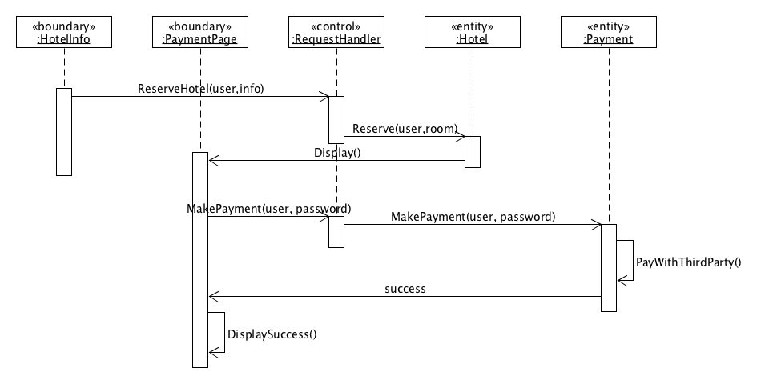
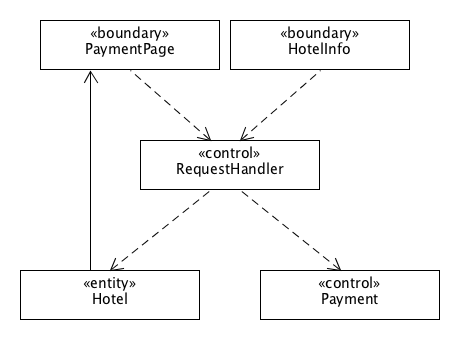
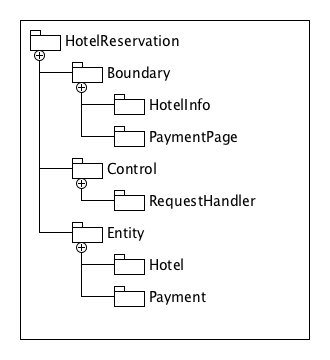

# 系统分析与设计第十六周作业

## 使用 ECB 实现 make reservation 用例的详细设计

### 用例简介

“预定酒店”这个用例，如果不包括搜索以及浏览酒店等前置过程。单独预定酒店来看包含用户选择预定的酒店，调整各种参数（时间、房间号等等），之后从网页前端提交酒店信息给服务器，服务器通知前端跳转至付款页面，之后用户在提交付款请求给服务器，服务器请求第三方付款系统后返回成功页面给用户。

### 顺序图

### 类图

## 将逻辑设计类图映射到实际项目框架的包图。

>  用树形结构表述实现的包和类

