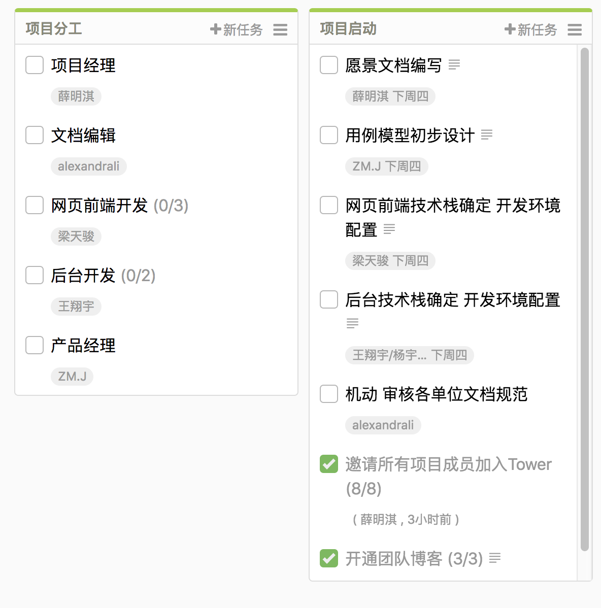

# 系统分析与设计第二周作业

## 简答题

###  简述瀑布模型、增量模型、螺旋模型（含原型方法）的优缺点。

#### 瀑布模型

瀑布模型是软件工程早期所采用的一种线性的软件开发模型，包含规划、分析、设计、编码、测试、运营等六个阶段，每个阶段的开始严格依赖于上一个阶段的结束。

瀑布模型的优点是阶段的分工十分严格和清晰，这样就十分利于项目本身的管理，包括人员的分配和项目周期的控制等等。

瀑布模型的缺点也是整个流程过于严格，导致十分不灵活，在一个阶段出错之后难以有良好定义的流程进行回溯。另外，由于在软件真正被开发出来之前很难了解真正的需求是什么，而瀑布模型的需求分析阶段一旦过去就没有机会再进行修补，即使发现问题也只能将错就错。

#### 增量模型

使用增量模型来做软件开发会经过多个重复的开发周期，每个开发周期包括需求分析、开发、测试和阶段评估四个阶段，每个开发周期都可以了解新的需求，进行设计的改动以及增加新的产品功能，这样一定程度上就能解决瀑布模型的低容错性的问题。增量模型的这个特点使得添加软件功能和修改需求在软件开发中付出的代价相对比较少，对过于严格的需求分析的要求也大大降低，一定程度上提高了容错性。

不过缺点在于增量模型对于软件的架构和代码实现要求较高，需要工程师写出易于拓展的代码才可以适用于增量开发的形式，软件如果实现质量糟糕的话在几次的迭代过后代码就会变得十分难以维护，迭代也难以进行下去。

#### 螺旋模型

螺旋模型是一个风险驱动的软件开发模型，虽然在重复开发周期这一点上与迭代开发十分类似，不过螺旋模型更加着重与对于风险的分析，在每个开发之前都需要对开发的投入和回报风险进行分析。这也就是螺旋模型的优势，把更多精力放在风险评估上可以大大降低项目失败的可能性，以及对团队当前的能力有一个较好的掌握。并且螺旋模型也具有迭代开发的一些固有优势。

不过螺旋模型的缺陷在于风险评估本身的开销，因此在一些相对较小的项目中，可能风险评估本身相对于整个项目本身来说就不是很值。而且风险评估的技术要求也非常高，这对团队的构成也提出了更高的要求。

###  简述 UP 的三大特点，其中哪些内容体现了用户驱动的开发，哪些内容体现风险驱动的开发？

Unified Process的三个特点分别为

##### 迭代开发（interative and incremental）

迭代开发指的是统一过程使用的开发流程以一个迭代和增量的开发流程为基础，包括项目启动（Inception）、精化（Elaboration）、建设（Construction）和移交（Transition）为一个周期，而每个阶段都包含对每个具体工作的评估，如建模、需求、分析设计、实现、测试以及部署。这样在整个项目的流程中对项目的开发流程就有一个比较好的把控。

##### 以软件架构为中心（architecture centric）

统一过程对于软件的架构非常重视，因为项目的系统架构的特殊性，因此在每个项目中都需要对软件系统仔细设计设计。而系统架构的基准也是软件精化过程中需要完成的一个重要成果，结合系统的部分实现可以对项目的整体状况进行一个认证，以及作为后续软件开发的基础。

##### 重视风险（risk-focused）

对风险的重视是统一过程的另一大特点，指的是软件迭代的每一个阶段都需要对于风险进行评估，以确定之后的开发计划或者是终止项目。

另外以及在其他地方也有提到用户驱动（client driven）或是使用案例驱动（use case driven）。指的是统一过程十分着重于以用户需求为开发的目标，开发出来的功能都一定基于使用情景的，是用户切实需要的，这样就避免了团队不必要的劳动。

###  UP 四个阶段的划分准则是什么？关键的里程碑是什么？

统一过程包括四个阶段：初始阶段、精化阶段、建设阶段和移交阶段。划分的准则在于某一阶段末是否达到标准中该阶段所要求的全部关键里程碑，其中里程碑的内容大致如下：

##### 初始阶段

生命周期目标里程碑，包括一些重要的文档，如项目构想、原始用例模型、原始业务风险评估、原始业务案例等等。阶段末需要对这些文档进行评审，正确理解用例需求、项目风险评估合理、阶段计划可行等等。

##### 精化阶段

生命周期体系结构里程碑。包括正式的风险分析文档、软件体系结构基线、项目计划、可执行的原型、初始的用户手册等等。通过评审确定软件体系结构已经稳定、高风险的业务需求和技术机制已经解决、修订的项目计划可行等等。

##### 构建阶段

初始运行能力里程碑。包括可以运行的软件产品、完成的用户手册等等，它们决定了产品是否可以在测试环境中进行部署。此时需要确定软件本身所在的环境适宜系统的运行。

##### 产品移交阶段

产品发布里程碑。确定最终目标是否实现，是否应该开发产品下一个版本的另一个开发周期。

###  IT 项目管理中，“工期、质量、范围/内容” 三个元素中，在合同固定条件下，为什么说“范围/内容”是项目团队是易于控制的

在IT项目管理中，项目的质量被三个因素所支配，分别为项目的预期开销、工期死线以及项目的实施范围。三个因素互相制约，因此要想保持产品的质量必须要在这三个因素中做出合理的平衡。在合同条件固定的情况下，显然工期是难以由乙方控制的；而项目的预算一般情况下会在项目伊始就确定好，不太可能在项目进行过程中对于预算进行过多的调整，因此最后，项目在开发过程中通过对于需求的不断重新认识，是可以对用户主要需求或是项目涉及的范围进行合理调整的，从这个角度上来说，项目的范围和内容对于开发团队来说是相对容易控制和调整的。

###  为什么说，UP 为企业按固定节奏生产、固定周期发布软件产品提供了依据？

Unified Process为软件项目开发提供了一个高度可操作的、严格的增量式的软件开发流程，其中包含了较为严格的软件开发周期定义，大部分的实践都为每个周期提供了一个大致的时间，因此在一个经验丰富的专业软件团队中，一个定义良好的周期和过程是十分利于软件开发的标准化的，也使得团队易于找到适宜的节奏并进行相应的调整。

另外，统一过程的阶段组织十分有利于项目结束后的总结和回顾，为之后的项目积累经验，为未来的项目找到更为适合的开发周期和形式，优化对人员的组织和资源调配形式。

## 项目管理工具使用

使用截图工具（png格式输出），展现你团队的任务 Kanban，请注意以下要求

- 每个人的任务是明确的。即一周后可以看到具体成果
- 每个人的任务是1-2项。
- 至少包含一个团队活动任务

我们团队的kanban地址[在这里](https://tower.im/projects/bb6d7eb9fc464d3394a8d2d2090db613/)

- 我是项目经理
- tower的kanban的任务不允许指派多人，在分工中前端开发和后端开发分别是三人和两人，在内部的subtask中体现
- 有关程序开发的任务之后都指派队长背锅

