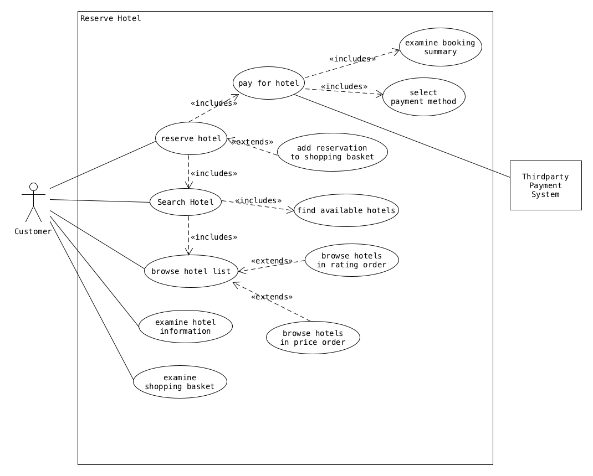
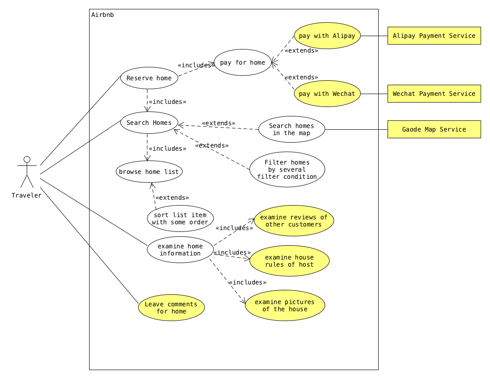
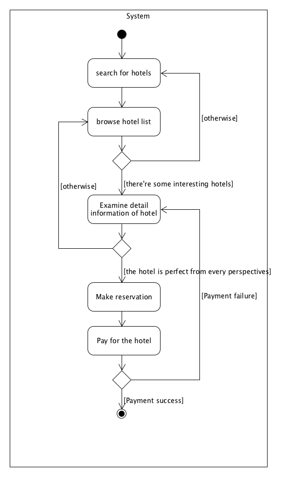
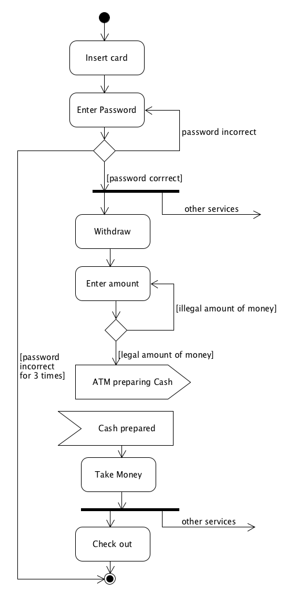
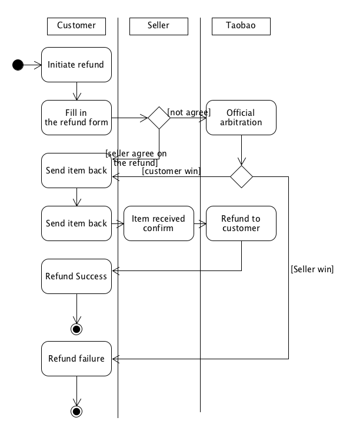

# 系统分析与设计第六周作业

## 1. 用例建模

### a. 阅读 [Asg_RH](./Asg_RH.pdf) 文档，绘制用例图。 按 Task1 要求，请使用工具 UMLet，截图格式务必是 png 并控制尺寸

### b. 选择你熟悉的定旅馆在线服务系统（或移动 APP），绘制用例图

> 并满足以下要求：
>
> - 对比 Asg_RH 用例图，请用色彩标注出创新用例或子用例
> - 尽可能识别外部系统，并用色彩标注新的外部系统和服务

### c. 对比两个时代、不同地区产品的用例图，总结在项目早期，发现创新的思路与方法

### d. 请使用 SCRUM 方法，在（任务b）用例图基础上，编制某定旅馆开发的需求 （backlog）

- 作为旅客，在主页上可以使用地区为关键词进行旅馆搜索
- 作为旅客，在主页上可以注册定旅馆账号
- 作为旅客，在主页上可以使用自己的账号进行登录
- 作为旅客，在搜索结果页可以以价格范围过滤搜索到的旅馆
- 作为旅客，在搜索结果页可以以地区范围过滤搜索到的旅馆
- 作为旅客，在搜索结果页可以在地图上查看自己搜索到的旅馆的位置和价格
- 作为旅客，在搜索结果页可以以价格来对搜索到的旅馆进行排序
- 作为旅客，在搜索结果页可以以旅馆名来对搜索到的旅馆进行排序
- 作为旅客，在搜索结果页可以查看搜索到的旅馆的详细信息
- 作为旅客，在搜索结果页可以使用关键字再次进行搜索
- 作为旅客，在旅馆详细信息页可以看到旅馆房间的照片
- 作为旅客，在旅馆详细信息页可以看到旅馆房间的被预定的信息
- 作为旅客，在旅馆详细信息页可以看到旅馆房间的详细价格
- 作为旅客，在旅馆详细信息页可以看到这个旅馆别的旅客的评价
- 作为旅客，在旅馆详细信息页可以预定这个旅店
- 作为旅客，在旅馆详细信息页可以返回刚才的搜索结果
- 作为旅客，在旅馆详细信息也可以查看旅馆的联系方式
- 作为入住过的旅客，在旅馆详细信息页可以对旅馆进行评价
- 作为旅客，在下订单页可以选择入住的时间范围
- 作为旅客，在下订单页可以选择支付方式
- 作为旅客，在下订单页可以看到自己订单的详细信息
- 作为旅客，在下订单页可以确认自己的订单
- 作为旅客，在下订单页可以取消自己的订单

## 2. 业务建模

### a. 在（任务b）基础上，用活动图建模找酒店用例。简述利用流程图发现子用例的方法

从活动图中可以看到完成某个主要用例所需要的具体步骤，从而可以从这些具体的步骤中提取出主要用例的子用例，比如说从上面活动图完成的“订酒店”这个用例来说，可以看出来订酒店需要“搜索酒店”，“查看具体酒店信息”，“下订单”，“支付”等步骤。订酒店的子用例是这些步骤的一个子集。

### b. 选择你身边的银行 ATM，用活动图描绘取款业务流程

### c. 查找淘宝退货业务官方文档，使用多泳道图，表达客户、淘宝网、淘宝商家服务系统、商家等用户和系统协同完成退货业务的过程。分析客户要完成退货业务，在淘宝网上需要实现哪些系统用例

在淘宝网上需要实现：介入用户和卖家的仲裁机制以及退款业务，当然，以及所有退款操作的客户端接口。

## 3. 用例文本编写

### 在大作业基础上，分析三种用例文本的优点和缺点

#### 用例图

用例图的优点是抽象层次较高，在不展示系统内部实现的状况下明确指出软件系统和多个外部实体之间的互动关系，可以很清晰地反应各种用户的需求。并且对于之后的交互测试也有很好的指导作用。

用例图的缺点在于它无法反应非交互情况下的系统表现，系统内部的的自身行为。并且用例图无法具体表示动作之间的先后顺序关系，因此有时候会不太利于理解系统的逻辑或者行为。

#### 活动图

活动图可以非常具体地展示出用户要完成某个动作所要经过的流程，几乎从原则上可以包含一切的处理逻辑，所以可以为软件的实现逻辑提供指导。

不过活动图的缺点在于有时候会过于具体，从而使整个活动图的逻辑的目的不够直观，而且往往一个活动图只能展示需求中很少很具体的一些部分。

#### 泳道图

泳道图在活动图的基础上添加了每个步骤的执行角色，使得活动图清晰地展示出为每个步骤负责的那个角色，这样就非常利于发现对于某个具体的行为系统各组成部分发挥的作用。

但是泳道图的缺点在于收到图本身结构的限制，在一个泳道图中的流程逻辑不能过于复杂，否则泳道图为了维持每个角色的分工会使得整个图在视觉上非常难以组织，最后就会显得十分混乱。因此只能展示某一个行为的主要逻辑。