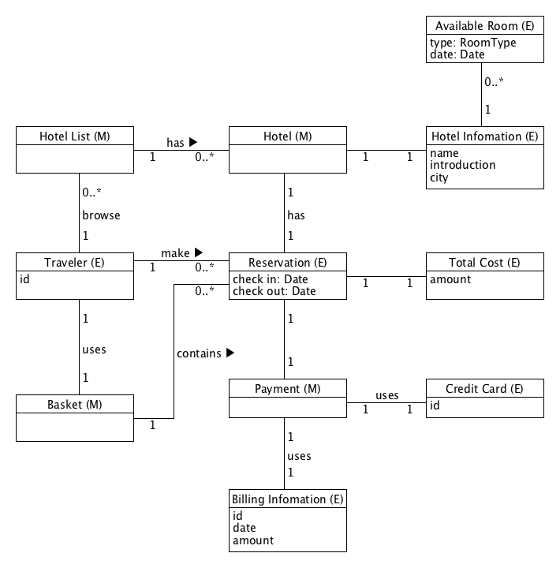
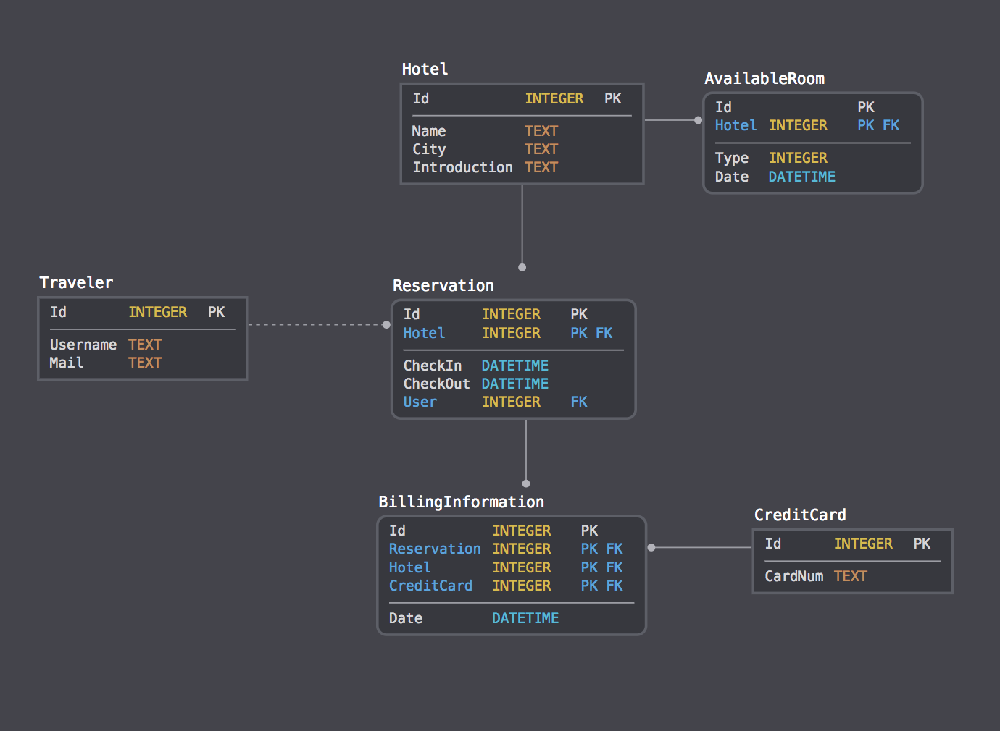

# 系统分析与设计第七周作业

## 领域建模

### a. 阅读 [Asg_RH](../week6/Asg_RH.pdf) 文档，按用例构建领域模型。

> - 按 Task2 要求，请使用工具 UMLet，截图格式务必是 png 并控制尺寸
> - 说明：请不要受 PCMEF 层次结构影响。你需要识别实体（E）和 中介实体（M，也称状态实体）
>    - 在单页面应用（如 vue）中，E 一般与数据库构建有关， M 一般与 [store 模式](https://cn.vuejs.org/v2/guide/state-management.html) 有关
>    - 在 java web 应用中，E 一般与数据库构建有关， M 一般与 session 有关



### b. 数据库建模(E-R 模型)

> - 按 Task 3 要求，给出系统的 E-R 模型（数据逻辑模型）
> - 建模工具 PowerDesigner（简称PD） 或开源工具 [OpenSystemArchitect](http://www.codebydesign.com/)
> - 不负责的链接 <http://www.cnblogs.com/mcgrady/archive/2013/05/25/3098588.html>
> - 导出 Mysql 物理数据库的脚本
> - 简单叙说 数据库逻辑模型 与 领域模型 的异同

使用工具：[sqldbm](https://sqldbm.com/)

#### 数据库设计图



#### 导出SQL脚本

``` sql
-- ****************** SqlDBM: MySQL ******************;
-- ***************************************************;

-- ************************************** `CreditCard`

CREATE TABLE `CreditCard`
(
 `Id`      INTEGER NOT NULL ,
 `CardNum` TEXT NOT NULL ,

PRIMARY KEY (`Id`)
);

-- ************************************** `Hotel`

CREATE TABLE `Hotel`
(
 `Id`           INTEGER NOT NULL ,
 `Name`         TEXT NOT NULL ,
 `City`         TEXT NOT NULL ,
 `Introduction` TEXT NOT NULL ,

PRIMARY KEY (`Id`)
);

-- ************************************** `Traveler`

CREATE TABLE `Traveler`
(
 `Id`       INTEGER NOT NULL ,
 `Username` TEXT NOT NULL ,
 `Mail`     TEXT NOT NULL ,

PRIMARY KEY (`Id`)
);

-- ************************************** `AvailableRoom`

CREATE TABLE `AvailableRoom`
(
 `Id`     NOT NULL ,
 `Hotel` INTEGER NOT NULL ,
 `Type`  INTEGER NOT NULL ,
 `Date`  DATETIME NOT NULL ,

PRIMARY KEY (`Id`, `Hotel`),
KEY `fkIdx_46` (`Hotel`),
CONSTRAINT `FK_46` FOREIGN KEY `fkIdx_46` (`Hotel`) REFERENCES `Hotel` (`Id`)
);

-- ************************************** `Reservation`

CREATE TABLE `Reservation`
(
 `Id`       INTEGER NOT NULL ,
 `Hotel`    INTEGER NOT NULL ,
 `CheckIn`  DATETIME NOT NULL ,
 `CheckOut` DATETIME NOT NULL ,
 `User`     INTEGER NOT NULL ,

PRIMARY KEY (`Id`, `Hotel`),
KEY `fkIdx_56` (`User`),
CONSTRAINT `FK_56` FOREIGN KEY `fkIdx_56` (`User`) REFERENCES `Traveler` (`Id`)
);

-- ************************************** `BillingInformation`

CREATE TABLE `BillingInformation`
(
 `Id`          INTEGER NOT NULL ,
 `Reservation` INTEGER NOT NULL ,
 `Hotel`       INTEGER NOT NULL ,
 `CreditCard`  INTEGER NOT NULL ,
 `Date`        DATETIME NOT NULL ,

PRIMARY KEY (`Id`, `Reservation`, `Hotel`, `CreditCard`),
KEY `fkIdx_50` (`Reservation`, `Hotel`),
CONSTRAINT `FK_50` FOREIGN KEY `fkIdx_50` (`Reservation`, `Hotel`) REFERENCES `Reservation` (`Id`, `Hotel`),
KEY `fkIdx_65` (`CreditCard`),
CONSTRAINT `FK_65` FOREIGN KEY `fkIdx_65` (`CreditCard`) REFERENCES `CreditCard` (`Id`)
);
```

#### 数据库模型和领域模型的异同

数据库模型和领域模型都可以反应一个系统中的实体以及实体之间的对应关系。但是领域模型着重于模拟系统在现实生活中的抽象概念，因此对诸如属性域的类型以及实体的识别并不是非常严格，领域模型的意图只是对整个系统中实体的抽象概念的详细描述。而数据库模型就需要完全是系统底层数据库设计和实现的一个映射，在表的设计和属性域的类型上就完全需要与底层所使用数据库相对应，并且数据库模型中会舍去一些领域模型中单纯为了连接不同实体，表达不同实体之间关系的中介实体。